# KOMPAK Product Requirements Document (PRD)

## Document Information

| Item | Value |
|------|-------|
| Project | KOMPAK (Komunitas Masyarakat Aktif) |
| Document | Product Requirements Document |
| Version | 1.0 |
| Status | Draft |
| Authors | KOMPAK Development Team |
| Last Updated | July 2026 |

---

## Purpose

This Product Requirements Document (PRD) defines the business objectives, functional requirements, business rules, system workflows, and technical constraints for the Minimum Viable Product (MVP) of KOMPAK.

The document serves as the primary reference for product planning, backend implementation, frontend development, testing, and future system enhancements.

---

# 1. Product Foundation

## 1.1 Product Overview

KOMPAK (Komunitas Masyarakat Aktif) is a community engagement platform designed to encourage active citizen participation in neighborhood activities organized by RT/RW administrators.

The platform digitizes community event management by providing secure attendance verification, participation tracking, reward redemption, leaderboard rankings, badge achievements, and community announcements within a single ecosystem.

Unlike conventional RT/RW management applications that primarily focus on administrative services, KOMPAK introduces a gamification approach to motivate citizens to participate consistently in community activities while encouraging collaboration with local businesses through reward sponsorship.

The MVP focuses on delivering a simple, transparent, and measurable participation ecosystem involving administrators, citizens, and reward providers.

---

## 1.2 Problem Statement

Community activities organized by RT/RW often experience low participation due to the absence of structured engagement mechanisms. Attendance is commonly recorded manually, making participation difficult to verify and monitor.

Current challenges include:

- Manual attendance recording.
- Lack of transparent participation tracking.
- No incentive mechanism for active citizens.
- Limited involvement of local businesses.
- No structured recognition for community contributions.

These limitations reduce citizen motivation and make it difficult for administrators to evaluate community participation over time.

---

## 1.3 Product Goals

KOMPAK aims to:

- Increase citizen participation in RT/RW community activities.
- Digitize attendance verification using secure geofence and face verification.
- Encourage long-term participation through gamification.
- Strengthen collaboration between RT/RW administrators and local businesses.
- Improve transparency in participation tracking and reward distribution.
- Recognize active citizens through monthly leaderboard rankings and badges.

---

## 1.4 Objectives

The MVP objectives are:

- Allow citizens to register and participate in community events.
- Allow administrators to organize and monitor community activities.
- Allow providers to sponsor rewards.
- Automatically calculate participation points.
- Support reward redemption through the Point Shop.
- Automatically determine monthly leaderboard rankings.
- Automatically distribute leaderboard rewards and badges.
- Notify users regarding important platform activities.

---

## 1.5 Stakeholders

### RT/RW Administrator

Responsible for managing users, providers, events, rewards, announcements, and overall platform operations.

---

### Citizen

Participates in community events, earns participation points, redeems Point Shop rewards, collects badges, and competes in the monthly leaderboard.

---

### Reward Provider

Local businesses or organizations that contribute rewards for citizens through sponsorship.

Providers are responsible for maintaining reward availability and confirming reward redemption.

---

## 1.6 User Roles

### Administrator

Administrators can:

- Approve or reject user registrations.
- Approve or reject provider registrations.
- Create, update, publish, and close events.
- Manage rewards.
- Manage badge definitions.
- Publish announcements.
- Monitor attendance.
- Monitor leaderboard rankings.
- Monitor reward redemptions.

---

### Citizen

Citizens can:

- Register an account.
- Update profile information.
- Browse community events.
- Submit attendance.
- Upload activity documentation.
- Earn participation points.
- Redeem Point Shop rewards.
- View badges.
- View leaderboard rankings.
- Receive notifications.

---

### Provider

Providers can:

- Register as reward providers.
- Manage sponsored rewards.
- Update reward stock.
- Confirm reward redemption.
- View redemption history.

---

# 2. Functional Requirements

## 2.1 Authentication

### Description

The authentication module manages user and provider registration, login, and account access.

### Functional Requirements

| ID | Requirement |
|----|-------------|
| FR-001 | The system shall allow citizens to register an account. |
| FR-002 | The system shall allow providers to register an account. |
| FR-003 | The system shall authenticate registered users. |
| FR-004 | The system shall securely hash user passwords. |
| FR-005 | The system shall provide authenticated sessions. |
| FR-006 | Only approved accounts shall access protected resources. |

---

## 2.2 User Management

### Description

The user management module allows administrators to manage citizen accounts while allowing citizens to maintain their own profiles.

### Functional Requirements

| ID | Requirement |
|----|-------------|
| FR-007 | Administrators shall view all registered users. |
| FR-008 | Administrators shall approve user registrations. |
| FR-009 | Administrators shall reject user registrations. |
| FR-010 | Administrators shall suspend user accounts. |
| FR-011 | Administrators shall reactivate suspended accounts. |
| FR-012 | Citizens shall update their profile information. |
| FR-013 | Citizens shall view attendance history. |
| FR-014 | Citizens shall view earned badges. |
| FR-015 | Citizens shall view participation points. |

---

## 2.3 Provider Management

### Description

The provider management module allows businesses to sponsor rewards after administrator approval.

### Functional Requirements

| ID | Requirement |
|----|-------------|
| FR-016 | Providers shall register an account. |
| FR-017 | Providers shall update business information. |
| FR-018 | Providers shall manage sponsored rewards. |
| FR-019 | Providers shall monitor reward redemptions. |
| FR-020 | Administrators shall approve provider registrations. |
| FR-021 | Administrators shall reject provider registrations. |

---

## 2.4 Event Management

### Description

The event management module enables administrators to organize community activities.

### Functional Requirements

| ID | Requirement |
|----|-------------|
| FR-022 | Administrators shall create events. |
| FR-023 | Administrators shall update events. |
| FR-024 | Administrators shall publish events. |
| FR-025 | Administrators shall cancel events. |
| FR-026 | Administrators shall close completed events. |
| FR-027 | Citizens shall view published events. |

Each event contains:

- Title
- Description
- Location
- Schedule
- Attendance radius
- Attendance window
- Participation points

---

## 2.5 Attendance Management

### Description

The attendance module verifies citizen participation using geofence validation and face verification.

### Functional Requirements

| ID | Requirement |
|----|-------------|
| FR-028 | Citizens shall submit attendance once per event. |
| FR-029 | The system shall verify user location before attendance is accepted. |
| FR-030 | The system shall verify user identity using face verification. |
| FR-031 | The system shall create an attendance record after successful verification. |
| FR-032 | Citizens may upload an activity description. |
| FR-033 | Citizens may upload one activity photo. |
| FR-034 | The system shall create an event transaction automatically. |
| FR-035 | The system shall award participation points automatically. |

---

## 2.6 Reward Management

### Description

The reward management module allows administrators and providers to manage Point Shop rewards and Leaderboard rewards.

### Functional Requirements

| ID | Requirement |
|----|-------------|
| FR-036 | Administrators shall manage rewards. |
| FR-037 | Providers shall manage rewards they own. |
| FR-038 | Rewards shall belong to either Point Shop or Leaderboard. |
| FR-039 | Leaderboard rewards shall not be redeemable through the Point Shop. |
| FR-040 | Point Shop rewards shall require participation points for redemption. |

---

## 2.7 Badge Management

### Description

The badge management module recognizes citizen participation and achievements.

### Functional Requirements

| ID | Requirement |
|----|-------------|
| FR-041 | The system shall award leaderboard badges automatically. |
| FR-042 | The system shall award milestone badges automatically. |
| FR-043 | Administrators shall award special badges manually. |
| FR-044 | Citizens shall view earned badges. |

---

## 2.8 Reward Redemption

### Description

Citizens may exchange participation points for Point Shop rewards.

### Functional Requirements

| ID | Requirement |
|----|-------------|
| FR-045 | Citizens shall redeem Point Shop rewards. |
| FR-046 | The system shall validate available points before redemption. |
| FR-047 | The system shall deduct participation points after redemption. |
| FR-048 | The system shall reduce reward stock automatically. |
| FR-049 | The system shall notify providers of new redemption requests. |
| FR-050 | Providers shall confirm reward completion. |

---

## 2.9 Notification Management

### Description

The notification module informs users about important platform activities.

### Functional Requirements

| ID | Requirement |
|----|-------------|
| FR-051 | The system shall notify users about account approval or rejection. |
| FR-052 | The system shall notify providers about approval or rejection. |
| FR-053 | The system shall notify users about newly published events. |
| FR-054 | The system shall send event reminders. |
| FR-055 | The system shall notify users about reward redemption status. |
| FR-056 | The system shall notify users about badge awards. |
| FR-057 | The system shall notify users about leaderboard rewards. |
| FR-058 | The system shall notify users about announcements. |

---

## 2.10 Announcement Management

### Description

The announcement module enables administrators to communicate important information to citizens.

### Functional Requirements

| ID | Requirement |
|----|-------------|
| FR-059 | Administrators shall publish announcements. |
| FR-060 | Active citizens shall view announcements. |
| FR-061 | Announcements may generate notifications. |

---

# 3. Business Rules

This section defines the business rules that govern the behavior of the KOMPAK platform. These rules serve as the authoritative reference for backend implementation and ensure that all platform features operate consistently.

---

## 3.1 User Registration and Approval

### Description

All citizens must be approved by an administrator before accessing the platform.

### Business Rules

| ID | Rule |
|----|------|
| BR-001 | Every newly registered citizen shall be assigned the `PENDING` status. |
| BR-002 | Only administrators may approve or reject user registrations. |
| BR-003 | Approved users shall have the `ACTIVE` status. |
| BR-004 | Rejected users shall have the `REJECTED` status. |
| BR-005 | Only users with the `ACTIVE` status may access protected platform features. |
| BR-006 | The system shall notify users after their registration status changes. |

---

## 3.2 Provider Registration and Approval

### Description

Reward providers must be verified before managing sponsored rewards.

### Business Rules

| ID | Rule |
|----|------|
| BR-007 | Every newly registered provider shall be assigned the `PENDING` status. |
| BR-008 | Only administrators may approve or reject provider registrations. |
| BR-009 | Approved providers shall have the `VERIFIED` status. |
| BR-010 | Rejected providers shall have the `REJECTED` status. |
| BR-011 | Only verified providers may create or manage rewards. |
| BR-012 | The system shall notify providers after their verification status changes. |

---

## 3.3 Event Management

### Description

Only published events are available for participation.

### Business Rules

| ID | Rule |
|----|------|
| BR-013 | Only administrators may create, update, publish, cancel, or close events. |
| BR-014 | Citizens may only view events with the `PUBLISHED` status. |
| BR-015 | Attendance is accepted only while the attendance window is active. |
| BR-016 | Cancelled or closed events shall not accept attendance submissions. |

---

## 3.4 Attendance Verification

### Description

Attendance verification ensures that participation is genuine before participation points are awarded.

### Business Rules

| ID | Rule |
|----|------|
| BR-017 | Citizens may submit attendance only once per event. |
| BR-018 | Attendance is permitted only for users with the `ACTIVE` status. |
| BR-019 | Attendance is permitted only for events with the `PUBLISHED` status. |
| BR-020 | Attendance must occur within the configured attendance window. |
| BR-021 | Users must be inside the configured attendance radius. |
| BR-022 | Users must successfully complete face verification. |
| BR-023 | Attendance shall be rejected if any validation fails. |
| BR-024 | Activity descriptions are optional. |
| BR-025 | Each attendance may include at most one activity photo. |

---

## 3.5 Attendance Processing

### Description

Successful attendance automatically updates participation records and user points.

### Business Rules

| ID | Rule |
|----|------|
| BR-026 | A successful attendance shall create one attendance record. |
| BR-027 | A successful attendance shall create one event transaction. |
| BR-028 | A successful attendance shall award participation points. |
| BR-029 | Point Shop points and Leaderboard points shall increase by the same amount. |
| BR-030 | Duplicate attendance transactions shall not be created. |

---

## 3.6 Participation Points

### Description

Participation points are earned by attending verified community events.

### Business Rules

| ID | Rule |
|----|------|
| BR-031 | Every event defines the number of participation points awarded upon successful attendance. |
| BR-032 | Point Shop points are used exclusively for reward redemption. |
| BR-033 | Leaderboard points are used exclusively for leaderboard ranking. |
| BR-034 | Resetting Leaderboard points shall not affect Point Shop points. |

---

## 3.7 Reward Management

### Description

Rewards are categorized based on how they are obtained.

### Business Rules

| ID | Rule |
|----|------|
| BR-035 | Every reward shall belong to exactly one reward source. |
| BR-036 | Supported reward sources are `POINT_SHOP` and `LEADERBOARD`. |
| BR-037 | Point Shop rewards may be redeemed using participation points. |
| BR-038 | Leaderboard rewards shall be distributed automatically by the system. |
| BR-039 | Leaderboard rewards shall not be redeemable through the Point Shop. |
| BR-040 | Rewards with the `LEADERBOARD` source shall have `points_required = 0`. |
| BR-041 | Rewards with the `LEADERBOARD` source shall have a valid `leaderboard_position`. |
| BR-042 | Rewards with the `POINT_SHOP` source shall have `leaderboard_position = NULL`. |
| BR-043 | Each leaderboard position may have at most one reward. |

---

## 3.8 Reward Redemption

### Description

Citizens may exchange participation points for Point Shop rewards.

### Business Rules

| ID | Rule |
|----|------|
| BR-044 | Only Point Shop rewards may be redeemed manually. |
| BR-045 | The system shall validate that the user account is active. |
| BR-046 | The system shall validate reward availability before redemption. |
| BR-047 | The system shall validate that sufficient participation points are available. |
| BR-048 | Successful redemption shall deduct participation points. |
| BR-049 | Successful redemption shall reduce reward stock. |
| BR-050 | Successful redemption shall create one reward redemption record. |
| BR-051 | Providers shall confirm reward completion after reward delivery. |

---

## 3.9 Monthly Leaderboard

### Description

The leaderboard recognizes the most active citizens every month.

### Business Rules

| ID | Rule |
|----|------|
| BR-052 | The leaderboard period is fixed to one calendar month for the MVP. |
| BR-053 | Leaderboard rankings are calculated using accumulated Leaderboard points within the current period. |
| BR-054 | The system shall determine the Top 3 citizens at the end of each leaderboard period. |
| BR-055 | The system shall automatically award leaderboard badges to the Top 3 citizens. |
| BR-056 | The system shall automatically distribute leaderboard rewards based on `leaderboard_position`. |
| BR-057 | The system shall notify winners after badge and reward distribution. |
| BR-058 | The system shall reset all Leaderboard points after monthly reward distribution is completed. |

---

## 3.10 Badge Management

### Description

Badges recognize citizen achievements and participation.

### Business Rules

| ID | Rule |
|----|------|
| BR-059 | The platform supports `LEADERBOARD`, `MILESTONE`, and `SPECIAL` badge categories. |
| BR-060 | Leaderboard badges shall be awarded automatically to the monthly Top 3 citizens. |
| BR-061 | Milestone badges shall be awarded automatically when predefined participation milestones are achieved. |
| BR-062 | Special badges may only be awarded by administrators. |
| BR-063 | Badge criteria are stored for documentation purposes only and are not evaluated dynamically by the system. |

---

## 3.11 Announcements

### Description

Announcements allow administrators to communicate important information to citizens.

### Business Rules

| ID | Rule |
|----|------|
| BR-064 | Only administrators may publish announcements. |
| BR-065 | Announcements shall be visible to all active citizens. |
| BR-066 | Announcements may generate notifications. |

---

## 3.12 Notifications

### Description

Notifications keep users informed about important platform activities.

### Business Rules

| ID | Rule |
|----|------|
| BR-067 | The system shall notify users after account approval or rejection. |
| BR-068 | The system shall notify providers after verification approval or rejection. |
| BR-069 | The system shall notify users when new events are published. |
| BR-070 | The system shall send event reminders before an event begins. |
| BR-071 | The system shall notify users about reward redemption updates. |
| BR-072 | The system shall notify users when leaderboard rewards are distributed. |
| BR-073 | The system shall notify users when badges are awarded. |
| BR-074 | The system shall notify users about published announcements. |

---

# 4. User & System Workflows

This section describes the primary workflows within the KOMPAK platform. These workflows illustrate how users interact with the system and how the system processes each operation.

---

## 4.1 Citizen Registration Workflow

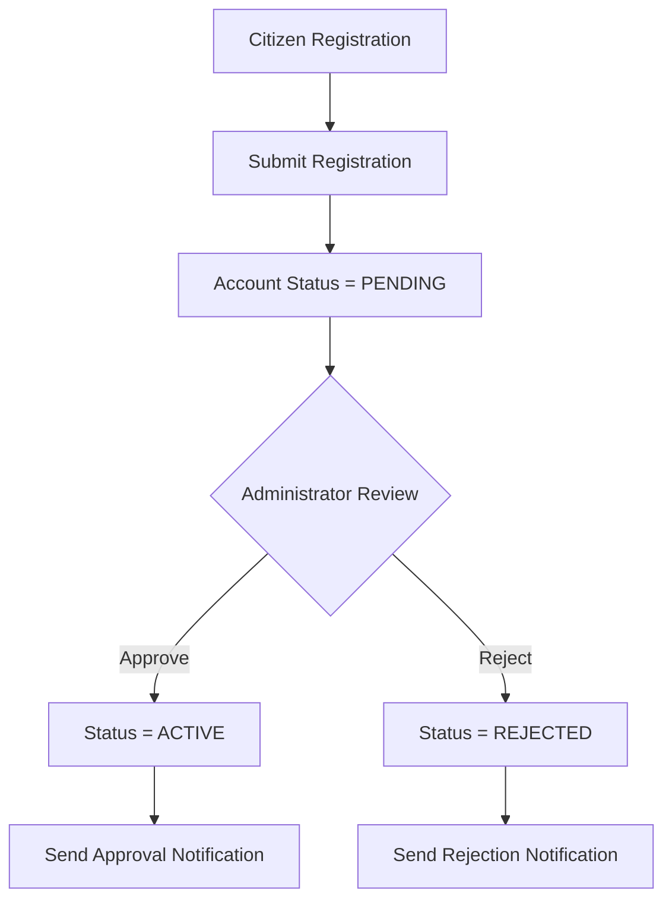

---

## 4.2 Provider Registration Workflow

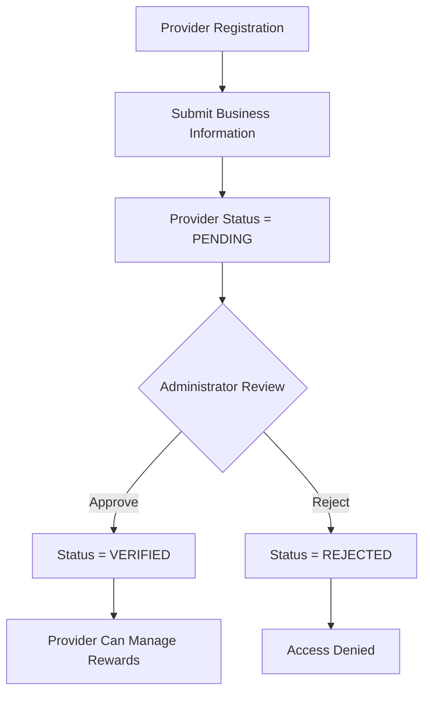

---

## 4.3 Event Participation Workflow

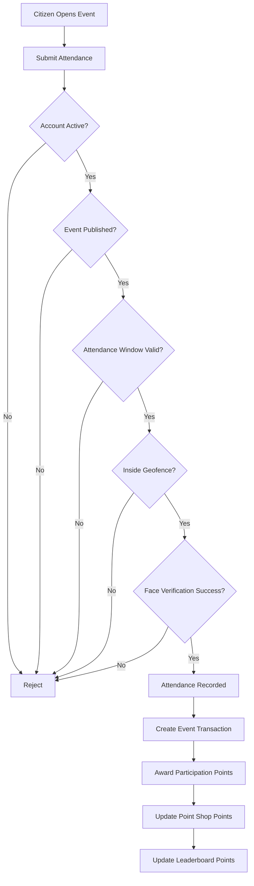

---

## 4.4 Point Shop Reward Redemption Workflow

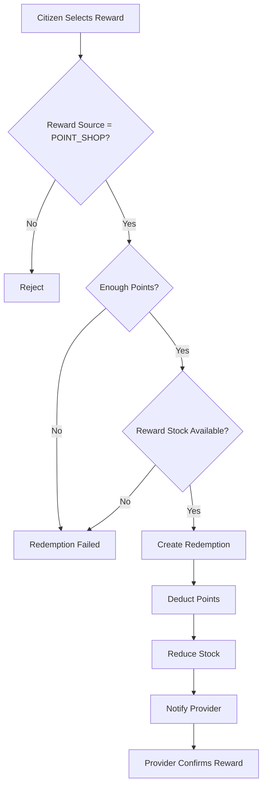

---

## 4.5 Monthly Leaderboard Workflow

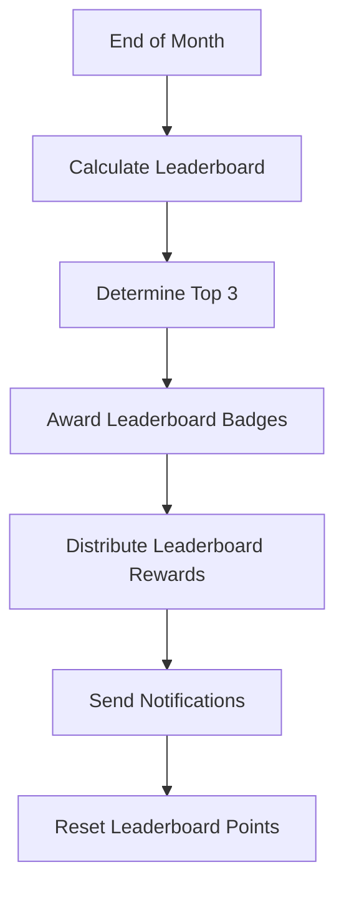

---

## 4.6 Announcement Workflow

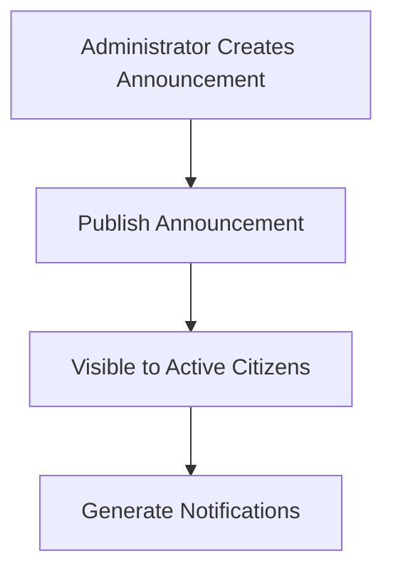

---

## 4.7 Notification Workflow

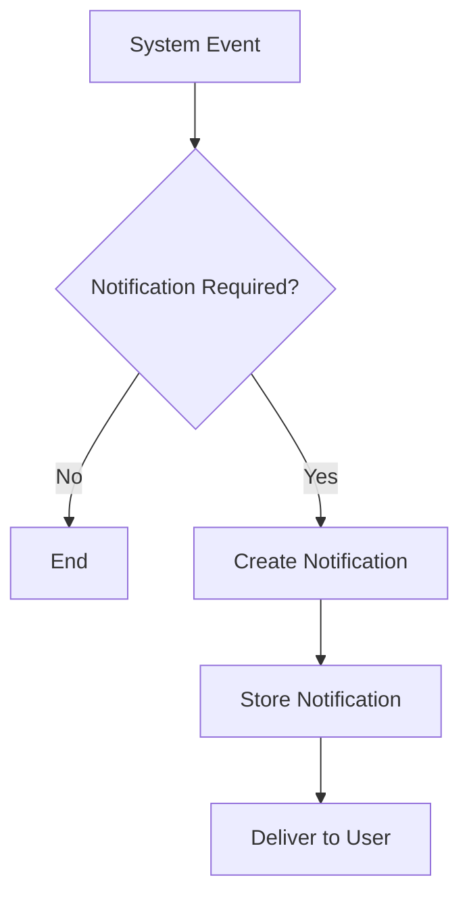

---

## 4.8 Reward Lifecycle

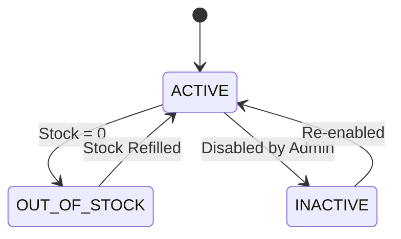

---

## 4.9 User State Lifecycle

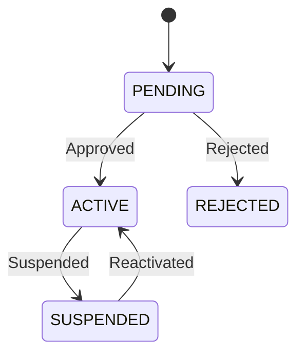

---

## 4.10 Provider State Lifecycle

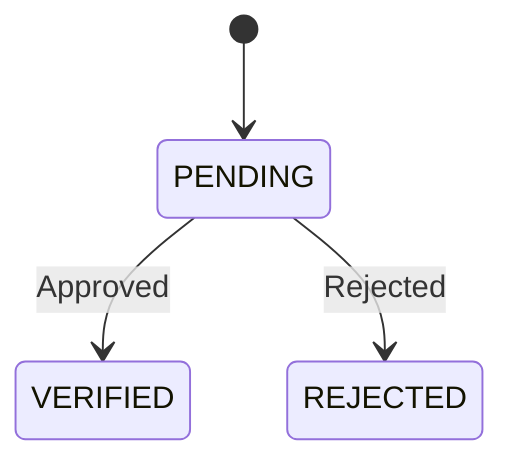
---

# 5. System Architecture

This section provides a high-level overview of the KOMPAK system architecture, including the interaction between clients, backend services, databases, and object storage.

---

## 5.1 High-Level Architecture

### Architecture Overview

KOMPAK adopts a serverless architecture to provide scalability, low operational overhead, and simplified deployment.

The system consists of four primary components:

- Flutter Mobile Application
- Hono REST API running on Cloudflare Workers
- Cloudflare D1 as the relational database
- Cloudflare R2 for object storage

### High-Level Architecture Diagram

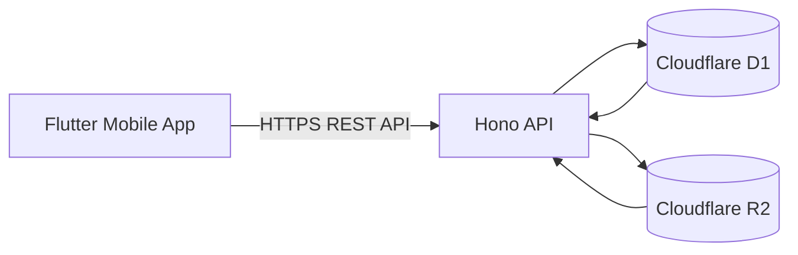

---

## 5.2 Technology Stack

| Layer | Technology |
|---------|------------|
| Mobile Application | Flutter |
| Backend Framework | Hono |
| Runtime | Cloudflare Workers |
| ORM | Drizzle ORM |
| Database | Cloudflare D1 |
| Object Storage | Cloudflare R2 |
| Authentication | Session-based Authentication |
| Face Verification | External Face Verification Service |
| Maps & Geolocation | Device GPS |

---

## 5.3 Core Modules

The KOMPAK backend consists of the following core modules.

| Module | Responsibility |
|---------|----------------|
| Authentication | User login and registration |
| User | Citizen management |
| Provider | Reward provider management |
| Event | Community event management |
| Attendance | Attendance verification |
| Reward | Point Shop and Leaderboard rewards |
| Redemption | Reward redemption |
| Badge | Badge management |
| Leaderboard | Monthly ranking |
| Announcement | Community announcements |
| Notification | User notifications |

---

## 5.4 Data Storage Responsibilities

### Cloudflare D1

Stores structured application data.

Examples include:

- Users
- Providers
- Events
- Attendances
- Rewards
- Badges
- Notifications
- Transactions

---

### Cloudflare R2

Stores uploaded files.

Examples include:

- Profile photos
- Activity photos
- Reward images
- Badge icons

Only file URLs are stored in the relational database.

---

## 5.5 Request Flow

The following diagram illustrates a typical request flow.

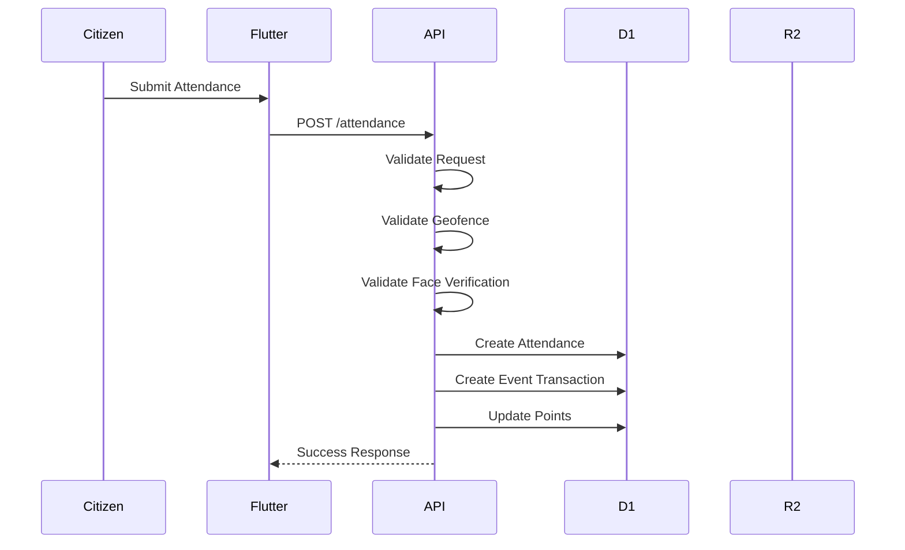

---

## 5.6 File Upload Flow

Activity photos, reward images, and profile photos are uploaded to Cloudflare R2.

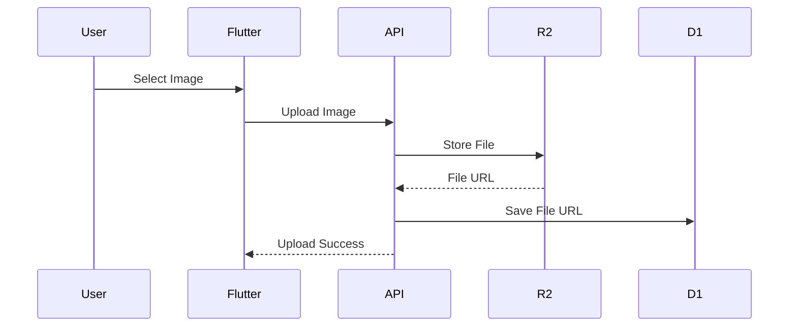

---

## 5.7 Security Overview

The MVP applies the following security principles:

- Passwords are securely hashed before storage.
- Protected endpoints require authenticated sessions.
- Only approved users may access protected resources.
- Attendance requires successful geofence validation.
- Attendance requires successful face verification.
- Uploaded files are stored separately from relational data.
- Authorization is enforced based on user roles.

---

## 5.8 Scalability Considerations

The serverless architecture enables the system to scale with increasing usage while minimizing infrastructure management.

The MVP architecture supports:

- Independent API scaling through Cloudflare Workers.
- Managed relational database using Cloudflare D1.
- Scalable object storage using Cloudflare R2.
- Stateless backend services.

---

# 6. API Architecture

This section describes the organization of the backend API. Rather than documenting every endpoint, it defines the API modules and their responsibilities. Detailed endpoint specifications should be documented separately using an API specification such as OpenAPI.

---

## 6.1 API Design Principles

The KOMPAK backend exposes a RESTful API implemented using Hono running on Cloudflare Workers.

The API follows these principles:

- RESTful resource naming.
- JSON request and response bodies.
- Stateless request processing.
- Session-based authentication.
- Consistent HTTP status codes.
- Standardized error responses.

---

## 6.2 API Modules

The backend is organized into independent modules based on business domains.

| Module | Base Path | Responsibility |
|---------|-----------|----------------|
| Authentication | `/auth` | Authentication and session management |
| Users | `/users` | User profile and account management |
| Providers | `/providers` | Provider management |
| Events | `/events` | Community event management |
| Attendances | `/attendances` | Attendance verification |
| Rewards | `/rewards` | Reward management |
| Reward Redemptions | `/reward-redemptions` | Reward redemption |
| Badges | `/badges` | Badge information |
| Announcements | `/announcements` | Community announcements |
| Notifications | `/notifications` | User notifications |
| Leaderboard | `/leaderboard` | Monthly rankings |

---

## 6.3 Authentication Flow

Protected endpoints require an authenticated session.

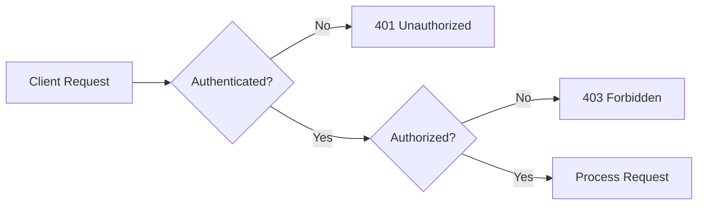

---

## 6.4 Authorization

Authorization is determined by the authenticated user's role.

| Role | Permissions |
|------|-------------|
| Administrator | Full system access |
| Citizen | Citizen features only |
| Provider | Provider features only |

---

## 6.5 API Response Format

Successful responses should use a consistent JSON structure.

### Success Response

```json
{
  "success": true,
  "message": "Attendance recorded successfully.",
  "data": {}
}
```

### Error Response

```json
{
  "success": false,
  "message": "Attendance verification failed.",
  "errors": []
}
```

---

## 6.6 HTTP Status Codes

The API should use standard HTTP status codes.

| Status Code | Description |
|-------------|-------------|
| 200 | Request succeeded |
| 201 | Resource created |
| 400 | Invalid request |
| 401 | Authentication required |
| 403 | Access forbidden |
| 404 | Resource not found |
| 409 | Business rule conflict |
| 422 | Validation failed |
| 500 | Internal server error |

---

## 6.7 Validation Strategy

Every request shall be validated before business logic execution.

Validation includes:

- Authentication.
- Authorization.
- Request schema validation.
- Business rule validation.

Requests failing validation shall not modify application data.

---

## 6.8 Business Rule Enforcement

Business rules are enforced within the service layer.

Examples include:

- User approval validation.
- Provider verification validation.
- Attendance validation.
- Geofence validation.
- Face verification.
- Point calculation.
- Reward redemption validation.
- Leaderboard reward distribution.

---

## 6.9 File Upload Strategy

Images are uploaded through the backend before being stored in Cloudflare R2.

Supported uploads include:

- Profile photos
- Activity photos
- Reward images
- Badge icons

The API stores only the object URL within the relational database.

---

## 6.10 Background Processes

Certain operations are executed automatically by the system.

Examples include:

- Monthly leaderboard calculation.
- Badge distribution.
- Leaderboard reward distribution.
- Leaderboard point reset.
- Event reminder notifications.

These operations are performed independently from user-initiated API requests.

---

# 7. Data Model

This section describes the logical data model of the KOMPAK platform. The data model defines the core entities, their relationships, and their responsibilities within the system.

The complete database schema is implemented using Drizzle ORM with Cloudflare D1 as the relational database.

---

## 7.1 Entity Relationship Diagram

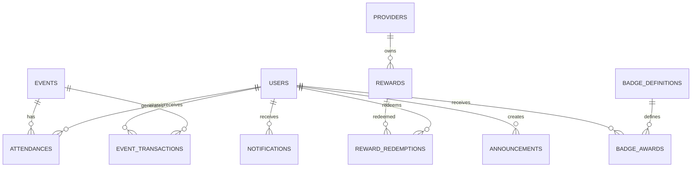

---

## 7.2 Core Entities

## Users

Stores citizen and administrator information.

### Responsibilities

- Authentication
- Profile information
- Point balances
- Leaderboard score
- Account status
- Role management

### Relationships

- One user can attend many events.
- One user can receive many badges.
- One user can redeem many rewards.
- One user can receive many notifications.
- One user can create many announcements (administrator).

---

## Providers

Stores information about reward providers.

### Responsibilities

- Provider verification
- Business information
- Reward ownership

### Relationships

- One provider owns many rewards.

---

## Events

Stores community activity information.

### Responsibilities

- Event schedule
- Attendance configuration
- Participation points
- Geofence configuration

### Relationships

- One event has many attendances.
- One event generates many transactions.

---

## Attendances

Stores verified citizen participation.

### Responsibilities

- Attendance verification
- Activity documentation
- Participation history

### Relationships

- Belongs to one user.
- Belongs to one event.

---

## Event Transactions

Stores point transactions generated from verified attendance.

### Responsibilities

- Participation history
- Point tracking
- Audit reference for earned points

### Relationships

- Belongs to one user.
- Belongs to one event.

---

## Rewards

Stores rewards available within the platform.

Rewards are divided into two categories:

- Point Shop Rewards
- Leaderboard Rewards

### Responsibilities

- Reward information
- Point requirements
- Stock management
- Reward ownership
- Leaderboard reward configuration

### Relationships

- Belongs to one provider.
- Has many reward redemptions.

---

## Reward Redemptions

Stores Point Shop redemption history.

### Responsibilities

- Redemption tracking
- Redemption status
- Provider verification

### Relationships

- Belongs to one user.
- Belongs to one reward.

---

## Badge Definitions

Stores badge metadata.

### Responsibilities

- Badge information
- Badge category
- Badge documentation
- Badge criteria

### Relationships

- Has many badge awards.

---

## Badge Awards

Stores badge ownership.

### Responsibilities

- Badge history
- Leaderboard period reference
- Award information

### Relationships

- Belongs to one user.
- Belongs to one badge definition.

---

## Announcements

Stores announcements published by administrators.

### Responsibilities

- Community communication
- Public information

### Relationships

- Created by one administrator.

---

## Notifications

Stores user notifications.

### Responsibilities

- User notifications
- Notification history

### Relationships

- Belongs to one user.

---

## 7.3 Data Ownership

| Entity | Owner |
|---------|-------|
| Users | Administrator |
| Providers | Administrator |
| Events | Administrator |
| Attendances | System |
| Event Transactions | System |
| Rewards | Provider / Administrator |
| Reward Redemptions | System |
| Badge Definitions | Administrator |
| Badge Awards | System |
| Announcements | Administrator |
| Notifications | System |

---

## 7.4 Data Integrity Rules

The platform enforces the following data integrity rules.

| ID | Rule |
|----|------|
| DM-001 | Each attendance belongs to exactly one user and one event. |
| DM-002 | A user may attend an event only once. |
| DM-003 | Each reward belongs to exactly one provider. |
| DM-004 | Only Point Shop rewards may be redeemed. |
| DM-005 | Each redemption belongs to exactly one reward. |
| DM-006 | Each badge award references exactly one badge definition. |
| DM-007 | Leaderboard rewards must have a valid leaderboard position. |
| DM-008 | Point Shop rewards shall not have a leaderboard position. |
| DM-009 | Only ACTIVE users may own newly created attendance records. |
| DM-010 | Notifications always belong to exactly one user. |

---

## 7.5 Data Lifecycle

### Attendance

```text
Created
    │
    ▼
Verified
    │
    ▼
Creates Event Transaction
    │
    ▼
Awards Points
```

---

### Reward Redemption

```text
Created
    │
    ▼
Pending
    │
    ▼
Completed
```

---

### Badge Award

```text
Eligible
    │
    ▼
Awarded
    │
    ▼
Visible on User Profile
```

---

### Leaderboard Reward

```text
End of Month
    │
    ▼
Top 3 Calculated
    │
    ▼
Reward Distributed
    │
    ▼
Leaderboard Reset
```
---

# 8. Non-Functional Requirements

This section defines the quality attributes that the KOMPAK platform must satisfy to ensure reliability, security, maintainability, and scalability throughout the MVP lifecycle.

---

## 8.1 Performance

The system should provide responsive performance under normal operating conditions.

### Requirements

| ID | Requirement |
|----|-------------|
| NFR-001 | API requests should return responses within an acceptable time under normal conditions. |
| NFR-002 | Database queries should be optimized to minimize unnecessary operations. |
| NFR-003 | Image uploads should not block other user interactions. |
| NFR-004 | Pagination should be applied to large datasets where appropriate. |

---

## 8.2 Availability

The platform should remain accessible whenever users need it.

### Requirements

| ID | Requirement |
|----|-------------|
| NFR-005 | The backend should be continuously available except during scheduled maintenance. |
| NFR-006 | Temporary service failures should return meaningful error responses. |

---

## 8.3 Reliability

The system should maintain consistent and accurate data.

### Requirements

| ID | Requirement |
|----|-------------|
| NFR-007 | Business rules shall be consistently enforced for every request. |
| NFR-008 | Failed operations shall not leave the database in an inconsistent state. |
| NFR-009 | Duplicate attendance records shall be prevented. |
| NFR-010 | Duplicate reward redemption caused by repeated requests shall be prevented. |

---

## 8.4 Security

The platform shall protect user accounts and application data.

### Requirements

| ID | Requirement |
|----|-------------|
| NFR-011 | User passwords shall never be stored in plain text. |
| NFR-012 | Protected endpoints shall require authenticated sessions. |
| NFR-013 | Authorization shall be enforced based on user roles. |
| NFR-014 | User input shall be validated before processing. |
| NFR-015 | Uploaded files shall be stored in Cloudflare R2 rather than the database. |
| NFR-016 | Only approved users may access protected platform features. |

---

## 8.5 Maintainability

The backend should be easy to maintain and extend.

### Requirements

| ID | Requirement |
|----|-------------|
| NFR-017 | The codebase should follow a modular architecture. |
| NFR-018 | Business logic should be separated from routing logic. |
| NFR-019 | Database access should be managed through Drizzle ORM. |
| NFR-020 | API responses should follow a consistent structure. |

---

## 8.6 Scalability

The platform should support future growth without significant architectural changes.

### Requirements

| ID | Requirement |
|----|-------------|
| NFR-021 | The serverless architecture should support increasing user traffic. |
| NFR-022 | Object storage should scale independently from relational data storage. |
| NFR-023 | Monthly leaderboard calculations should not affect normal API operations. |

---

## 8.7 Usability

The platform should provide a simple and intuitive user experience.

### Requirements

| ID | Requirement |
|----|-------------|
| NFR-024 | Users should be able to complete common tasks with minimal steps. |
| NFR-025 | Error messages should be clear and actionable. |
| NFR-026 | Notifications should clearly communicate important platform events. |

---

## 8.8 Compatibility

The MVP is designed primarily for mobile usage.

### Requirements

| ID | Requirement |
|----|-------------|
| NFR-027 | The backend API shall be consumable by the Flutter mobile application. |
| NFR-028 | API communication shall use JSON over HTTPS. |

---

## 8.9 Data Integrity

The system shall preserve the consistency of application data.

### Requirements

| ID | Requirement |
|----|-------------|
| NFR-029 | Foreign key relationships shall remain valid. |
| NFR-030 | Unique constraints shall prevent duplicate business records. |
| NFR-031 | Reward stock shall never become negative. |
| NFR-032 | Point balances shall never become negative after redemption. |

---

# 9. MVP Scope

This section defines the features included in the Minimum Viable Product (MVP) and identifies features intentionally excluded from the initial release.

The MVP focuses on delivering the core functionality required to support citizen participation, event attendance verification, reward management, and community engagement.

---

## 9.1 Included Features

The following features are included in the MVP.

| Feature | Description |
|---------|-------------|
| Authentication | User registration, login, logout, and session management. |
| User Management | User profile management and administrator approval workflow. |
| Provider Management | Provider registration, verification, and profile management. |
| Event Management | Create, update, publish, and manage community events. |
| Attendance Verification | Attendance submission with geofence and face verification. |
| Activity Documentation | Store activity description and a single activity photo for each attendance. |
| Point System | Award participation points after successful attendance verification. |
| Monthly Leaderboard | Rank citizens based on accumulated participation points and reset rankings every month. |
| Reward Management | Manage Point Shop rewards and Leaderboard rewards. |
| Reward Redemption | Redeem Point Shop rewards and manage redemption status. |
| Badge System | Award badges based on predefined achievement criteria. |
| Announcement Management | Publish announcements to all active citizens. |
| Notification System | Notify users about important system events such as approvals, rewards, badges, and announcements. |

---

## 9.2 Excluded Features

The following features are intentionally excluded from the MVP to maintain a manageable project scope.

| Feature | Reason for Exclusion |
|---------|----------------------|
| Multi-photo attendance documentation | A single activity photo is sufficient for attendance verification. |
| Social interactions (likes, comments, sharing) | Not essential to the primary objectives of the platform. |
| In-app messaging or chat | Increases implementation complexity and is outside the MVP scope. |
| Advanced analytics dashboard | Can be introduced after sufficient operational data has been collected. |
| Reward delivery tracking | Manual provider confirmation is sufficient for the MVP. |
| Push notifications | Standard in-app notifications satisfy current communication requirements. |
| Multiple leaderboard categories | A single monthly leaderboard is adequate for the initial release. |
| Reward recommendation engine | Not required for the initial implementation. |
| Event registration or participant quota | All active users may participate without prior registration. |
| Offline attendance submission | Internet connectivity is required during attendance verification. |

---

## 9.3 MVP Success Criteria

The MVP is considered successful when the following objectives are achieved.

| ID | Success Criterion |
|----|-------------------|
| MVP-001 | Citizens can successfully register and receive administrator approval. |
| MVP-002 | Administrators can create and publish community events. |
| MVP-003 | Citizens can verify attendance using geofence and face verification. |
| MVP-004 | Verified attendance automatically generates participation points. |
| MVP-005 | Monthly leaderboards are calculated correctly and reset automatically. |
| MVP-006 | Point Shop rewards can be redeemed successfully. |
| MVP-007 | Leaderboard rewards and badges are distributed automatically at the end of each month. |
| MVP-008 | Notifications are generated for major platform events. |

---

## 9.4 MVP Assumptions

The MVP is developed under the following assumptions.

- Citizens have internet connectivity when using the application.
- Users grant location permission for geofence verification.
- Users grant camera permission for face verification.
- Face verification services are available when attendance is submitted.
- Providers are responsible for fulfilling redeemed rewards.
- Administrators review user and provider registrations in a timely manner.

---

# 10. Future Enhancements

This section outlines potential improvements that may be implemented in future releases after the successful completion of the MVP.

These enhancements are intended to improve user engagement, operational efficiency, and long-term scalability while remaining aligned with the objectives of the KOMPAK platform.

---

## 10.1 Community Engagement

Future versions may introduce features that encourage greater community participation.

| Feature | Description |
|---------|-------------|
| Community Challenges | Organize themed participation campaigns (e.g., Clean Environment Month). |
| Participation Streaks | Reward users for maintaining consecutive participation in community activities. |
| Community Statistics | Display participation statistics at neighborhood or community levels. |
| Seasonal Events | Organize limited-time events with exclusive rewards and badges. |

---

## 10.2 Reward System Enhancements

The reward system can be expanded to provide greater flexibility and motivation.

| Feature | Description |
|---------|-------------|
| Reward Categories | Organize rewards into categories such as Food, Shopping, or Public Services. |
| Reward Expiration | Configure validity periods for redeemable rewards. |
| Digital Reward Vouchers | Generate QR codes or digital vouchers after successful redemption. |
| Reward Search & Filtering | Allow users to search and filter available rewards. |

---

## 10.3 Event Management Enhancements

Additional event management capabilities may improve the overall participation experience.

| Feature | Description |
|---------|-------------|
| Event Registration | Allow citizens to register before participating in events. |
| Participant Quotas | Limit the number of participants for selected events. |
| Event Attendance Reports | Generate attendance reports for administrators. |
| Event Templates | Reuse predefined event configurations. |

---

## 10.4 User Experience Improvements

Future releases may improve usability and accessibility.

| Feature | Description |
|---------|-------------|
| Push Notifications | Deliver real-time notifications through mobile devices. |
| Dark Mode | Provide an alternative visual theme for improved accessibility. |
| Multi-language Support | Support additional languages beyond the initial release. |
| Offline Data Caching | Improve usability under unstable network conditions. |

---

## 10.5 Analytics and Reporting

Analytical features may assist administrators in evaluating community participation.

| Feature | Description |
|---------|-------------|
| Participation Dashboard | Visualize participation trends over time. |
| Reward Analytics | Monitor reward popularity and redemption statistics. |
| Provider Performance Reports | Evaluate provider contributions and reward fulfillment. |
| Community Activity Reports | Summarize participation by event, period, or location. |

---

## 10.6 Integration Opportunities

The platform may integrate with external systems in future releases.

| Feature | Description |
|---------|-------------|
| Government Information Systems | Synchronize relevant citizen or community data where permitted. |
| Digital Payment Services | Support online purchases of premium rewards if applicable. |
| Email Services | Send important notifications via email. |
| Calendar Integration | Export community events to users' personal calendars. |

---

## 10.7 Artificial Intelligence Opportunities

Artificial Intelligence may be introduced to enhance decision-making and user engagement.

| Feature | Description |
|---------|-------------|
| Personalized Reward Recommendations | Recommend rewards based on user preferences and participation history. |
| Event Recommendations | Suggest relevant events based on previous activities. |
| Participation Prediction | Identify declining participation trends for early intervention. |
| Intelligent Moderation | Assist administrators in reviewing user-submitted content. |

---

## 10.8 Long-Term Vision

The long-term vision of KOMPAK is to become a comprehensive digital community engagement platform that encourages active citizen participation, simplifies community activity management, and strengthens collaboration between citizens, providers, and administrators through technology-driven solutions.

---

# 11. Assumptions & Constraints

This section documents the assumptions and constraints established during the planning and design of the KOMPAK MVP. These considerations define the project's boundaries and serve as a reference for implementation and future enhancements.

---

## 11.1 Assumptions

The following assumptions were made during the design and development of the KOMPAK platform.

| ID | Assumption |
|----|------------|
| AC-001 | All users have access to a smartphone with internet connectivity. |
| AC-002 | Users grant location permission for geofence verification. |
| AC-003 | Users grant camera permission for face verification during attendance. |
| AC-004 | Face verification services are available whenever attendance is submitted. |
| AC-005 | Administrators review user and provider registrations in a timely manner. |
| AC-006 | Providers are responsible for fulfilling redeemed rewards after redemption approval. |
| AC-007 | Community events are created and managed only by authorized administrators. |
| AC-008 | Attendance verification is performed only during the configured attendance period. |
| AC-009 | Participation points are awarded only after successful attendance verification. |
| AC-010 | Monthly leaderboard calculations are executed automatically at the end of each month. |

---

## 11.2 Business Constraints

The MVP intentionally limits several business processes to reduce implementation complexity.

| ID | Constraint |
|----|------------|
| BC-001 | Only one attendance record is permitted per user for each event. |
| BC-002 | Each attendance stores only one activity photo. |
| BC-003 | Only active users may participate in community events. |
| BC-004 | Only verified providers may create and manage rewards. |
| BC-005 | Only Point Shop rewards may be redeemed manually by users. |
| BC-006 | Leaderboard rewards are distributed automatically by the system. |
| BC-007 | Leaderboard badges are awarded automatically based on monthly rankings. |
| BC-008 | Leaderboard points are reset automatically after monthly reward distribution. |
| BC-009 | Point Shop points and Leaderboard points are awarded simultaneously from the same verified attendance. |
| BC-010 | Leaderboard rankings are calculated using monthly accumulated participation points only. |

---

## 11.3 Technical Constraints

The following technical limitations apply to the MVP implementation.

| ID | Constraint |
|----|------------|
| TC-001 | The backend is implemented using Hono running on Cloudflare Workers. |
| TC-002 | Cloudflare D1 is used as the relational database. |
| TC-003 | Cloudflare R2 is used for storing uploaded images and files. |
| TC-004 | The mobile application is developed using Flutter. |
| TC-005 | Database access is implemented through Drizzle ORM. |
| TC-006 | Communication between client and server uses HTTPS with JSON payloads. |
| TC-007 | Uploaded files are referenced by URL in the database rather than stored as binary data. |
| TC-008 | Background processes such as leaderboard calculation are executed independently of user requests. |

---

## 11.4 Scope Constraints

To ensure timely delivery, several features are intentionally excluded from the MVP.

| ID | Constraint |
|----|------------|
| SC-001 | Social interaction features (likes, comments, and sharing) are excluded. |
| SC-002 | In-app messaging is not supported. |
| SC-003 | Push notifications are not included in the MVP. |
| SC-004 | Offline attendance submission is not supported. |
| SC-005 | Multi-photo attendance documentation is not supported. |
| SC-006 | Event participant quotas are not implemented. |
| SC-007 | Advanced analytics dashboards are outside the MVP scope. |
| SC-008 | Reward recommendation using Artificial Intelligence is not included in the MVP. |

---

## 11.5 Risks

The following risks should be considered during implementation.

| ID | Risk | Mitigation |
|----|------|------------|
| R-001 | Users deny location permission. | Display clear guidance and require permission before attendance. |
| R-002 | Face verification service is unavailable. | Inform users and allow retry while preventing invalid attendance records. |
| R-003 | Poor internet connectivity delays attendance submission. | Provide clear error messages and allow users to retry. |
| R-004 | High participation volume during major events. | Utilize the serverless architecture to handle increased workloads. |
| R-005 | Providers delay reward fulfillment. | Track redemption status and notify both providers and users. |

---

## 11.6 Future Revision

This PRD is intended for the initial MVP release of KOMPAK.

Future revisions may update:

- Business requirements.
- Functional requirements.
- Database design.
- API architecture.
- Technology stack.
- Product roadmap.

Changes shall be documented through version updates to maintain traceability and consistency throughout the development lifecycle.